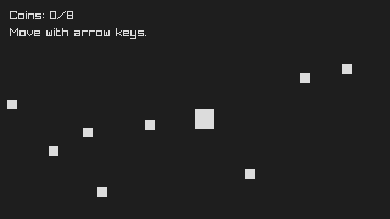
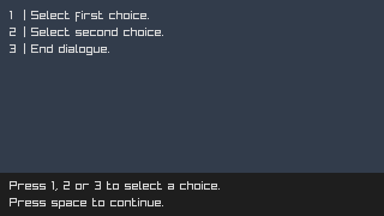

# Examples

You can run every example with:

```d
void main() {
    import popka.examples;
    runEveryExample();
}
```

## [Hello](hello.d)

This example serves as a classic hello-world program, introducing the fundamental structure of a Popka program.


You can run the example with:

```d
void main() {
    import popka.examples;
    runHelloExample();
}
```

## [Coins](coins.d)

This example shows how to create a simple game with Popka.



You can run the example with:

```d
void main() {
    import popka.examples;
    runCoinsExample();
}
```

## [Pong](pong.d)

This example shows how to create a pong-like game with Popka.


You can run the example with:

```d
void main() {
    import popka.examples;
    runPongExample();
}
```

## [Camera](camera.d)

This example shows how to use the camera structure of Popka.


You can run the example with:

```d
void main() {
    import popka.examples;
    runCameraExample();
}
```

## [Dialogue](dialogue.d)

This example shows how to use the Popka dialogue system.



You can run the example with:

```d
void main() {
    import popka.examples;
    runDialogueExample();
}
```
